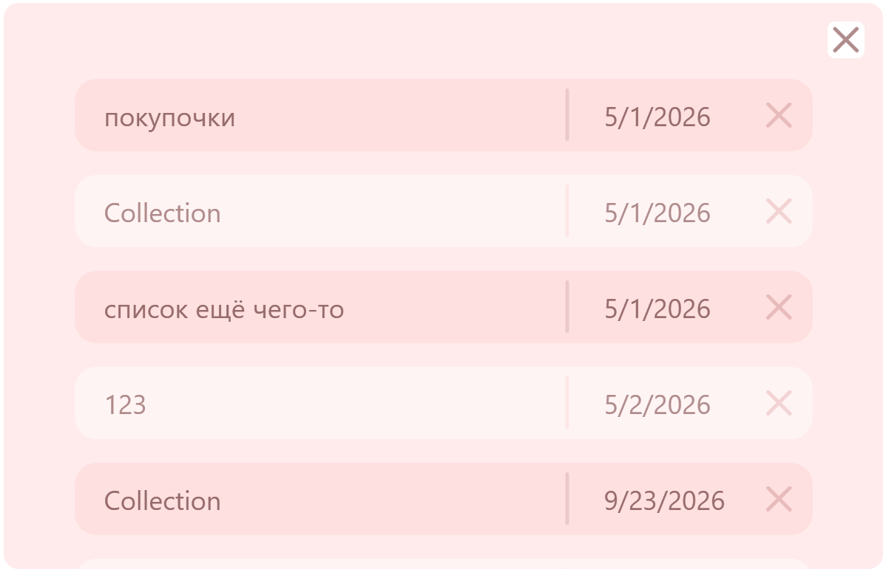
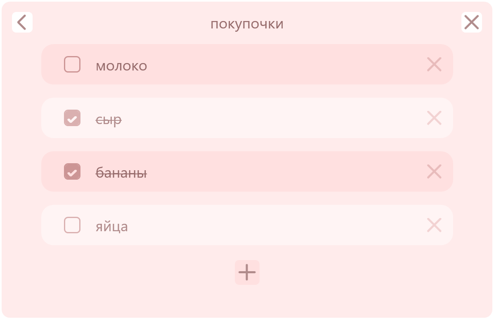

# ToDoList (WPF Desktop Application)

Десктопное приложение для управления списками задач, разработанное на стеке **.NET 10** с использованием архитектурного паттерна **MVVM**.


## 📋 Содержание

- [Скачать](#-скачать)
- [Основные возможности](#-основные-возможности)
- [Технологический стек](#-технологический-стек)
- [Архитектурные решения](#--архитектурные-решения)
- [Скриншоты приложения](#-скриншоты-приложения)
- [Сборка из исходников](#-сборка-из-исходников)
- [Автор](#-автор)


## 📥 Скачать

Готовую сборку можно взять на странице [**Releases**](https://github.com/LinaKhatib/ToDoList/releases/latest).

1. Скачайте `ToDoList.exe` и `appsettings.example.json`.
2. Создайте рядом с `.exe` папку `Model\Data\DatabaseProvider\`.
3. Положите в неё `appsettings.example.json` и **переименуйте** его в `appsettings.json`.
4. Откройте `appsettings.json` и впишите свою строку подключения к PostgreSQL:
   ```json
   {
     "ConnectionStrings": {
       "DefaultConnection": "Host=localhost;Port=5432;Database=ВАШЕ_ИМЯ_БД;Username=ВАШ_ЛОГИН;Password=ВАШ_ПАРОЛЬ"
     }
   }
   ```
5. Запустите `ToDoList.exe`.

> **Требуется PostgreSQL.** Если у вас его нет — установите с [официального сайта](https://www.postgresql.org/download/windows/).


## ✨ Основные возможности
*   **Управление задачами:** создание, редактирование и удаление списков и отдельных задач.
*   **Иерархическая структура:** поддержка вложенности (списки внутри списков).
*   **Автоматическое оформление:** интеллектуальное обновление визуального состояния элементов («зебра») при изменении состава коллекции.

##  🛠 Технологический стек
*   **C# / .NET 10** (WPF)
*   **База данных:** PostgreSQL
*   **ORM:** Entity Framework Core (EF Core)
*   **Паттерны:** MVVM, Generic Repository, Dependency Injection.
*   **CI/CD:** GitHub Actions (автоматическая сборка релизов)

##  🏗  Архитектурные решения
Проект спроектирован с упором на чистоту кода и разделение ответственности:

1.  **MVVM Pattern:** полное разделение логики и представления.
2.  **Command Pattern:** вся логика взаимодействия с пользователем вынесена в команды.
3.  **Generic Repository:** универсальный слой доступа к данным, сокращающий дублирование кода при работе с БД.
4.  **Navigation Service:** кастомный сервис для управления переходами между окнами приложения.


## 📸 Скриншоты приложения





## 🔨 Сборка из исходников

### Требования

- [.NET 10 SDK](https://dotnet.microsoft.com/download)
- PostgreSQL (установленный и запущенный)

### Шаги

**1. Клонируйте репозиторий:**
```bash
git clone https://github.com/LinaKhatib/ToDoList.git
cd ToDoList
```

**2. Настройте базу данных:**

Скопируйте шаблон и откройте его:

```bash
cd ToDoList/Model/Data/DatabaseProvider
copy appsettings.example.json appsettings.json
```

Откройте `appsettings.json` и впишите свои данные:

```json
{
  "ConnectionStrings": {
    "DefaultConnection": "Host=localhost;Port=5432;Database=ВАШЕ_ИМЯ_БД;Username=ВАШ_ЛОГИН;Password=ВАШ_ПАРОЛЬ"
  }
}
```

**3. Соберите и запустите:**

```bash
cd ../../..
dotnet build
dotnet run --project ToDoList
```

> **Примечание:** `appsettings.json` игнорируется системой Git — ваши личные данные не попадут в репозиторий.

## 👤 Автор
### Лина Хатиб

- GitHub: [@LinaKhatib](https://github.com/LinaKhatib)
- Email: hatiblina1@gmail.com
- Telegram: [@linax_U](https://t.me/linax_U)